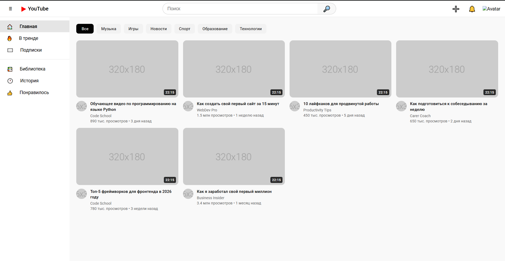
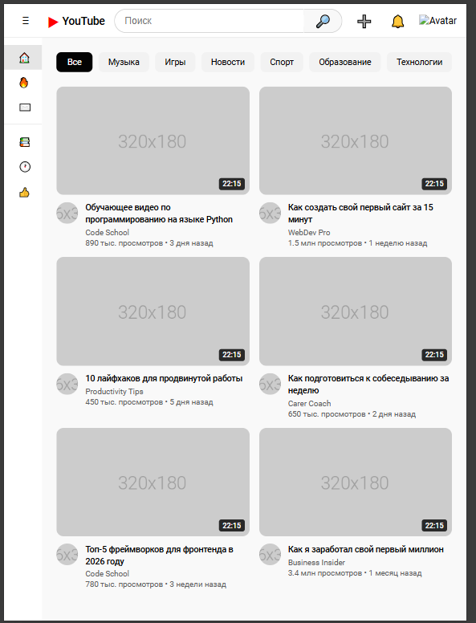
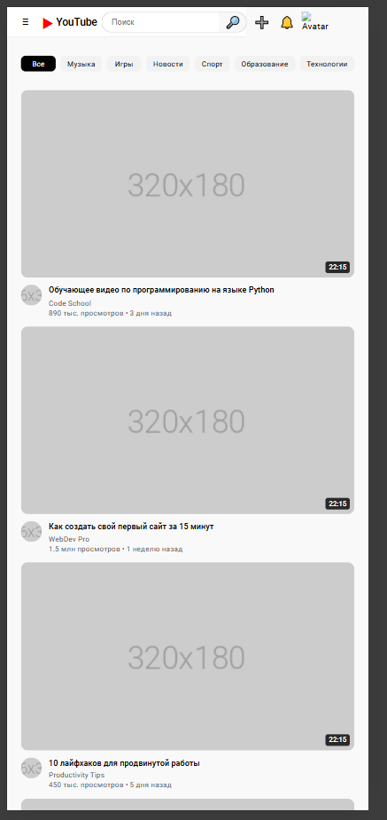

# YouTube Clone - Лабораторная работа №9-10
---

**Студент:** [Гвоздева, Деушев]
**Группа:** [ИСП - 231]

---

## Описание
[Напишите 2-3 предложения о том, что это за проект. Например: "Адаптивный клон главной
страницы YouTube, созданный с использованием HTML, CSS, Flexbox и CSS Grid."]

---

## Реализованные функции
- [x] Адаптивный хедер с поиском
- [x] Боковая панель навигации
- [x] Категории (чипсы) с интерактивностью
- [x] Сетка видео с карточками
- [x] Hover-эффекты на карточках
- [x] Полная адаптивность под все устройства
- [ ] [Добавьте свои функции]

---

## Технологии
- HTML5
- CSS3
- Flexbox
- CSS Grid
- Media Queries

---

## Скриншоты

### Desktop (1920px)

### Tablet (1024px)

### Mobile (375px)

---

## Как запустить

1. Откройте файл `index.html` в браузере
2. Или используйте **Live Server** в VS Code:
    - Установите расширение Live Server
    - Правой кнопкой по `index.html` → Open with Live Server

---

## Структура проекта

- Lab11_YouTube_Gvozdeva_Deushev/
    - img/
        - adaptiv_desktop_Gvozdeva_Deushev.png
        - adaptiv_mobile_Gvozdeva_Deushev.png
        - adaptiv_tablet_Gvozdeva_Deushev.png 
        - step1_basic_Gvozdeva_Deushev.png 
        - step2_reset_Gvozdeva_Deushev.png 
        - step3_header_html_Gvozdeva_Deushev.png 
        - step4_header_flexbox_Gvozdeva_Deushev.png
        - step5_styled_buttons_Gvozdeva_Deushev.png
        - step6_search_Gvozdeva_Deushev.png
        - step7_sidebar_html_Gvozdeva_Deushev.png
        - step8_layout_Gvozdeva_Deushev.png
        - step9_chips_Gvozdeva_Deushev.png
        - step10_card_html_Gvozdeva_Deushev.png
        - step11_card_styled_Gvozdeva_Deushev.png
        - step12_grid_Gvozdeva_Deushev.png 
        - step13_hover_Gvozdeva_Deushev.png
        - step14_adaptiv_Gvozdeva_Deushev.png
    - index.html
    - README.md
    - style.css

---

## Вывод
В ходе выполнения лабораторной работы я закрепила создание сложных макетов с использованием технологий CSS. Я научилась создавать интерактивные элементы, такие как категории-чипсы и карточки видео с hover-эффектами, а также освоила CSS Grid для построенрия адаптивной сетки, которая автоматически подстраивается под различные разрешения экрана.

---

## Дата выполнения

23.02.2026